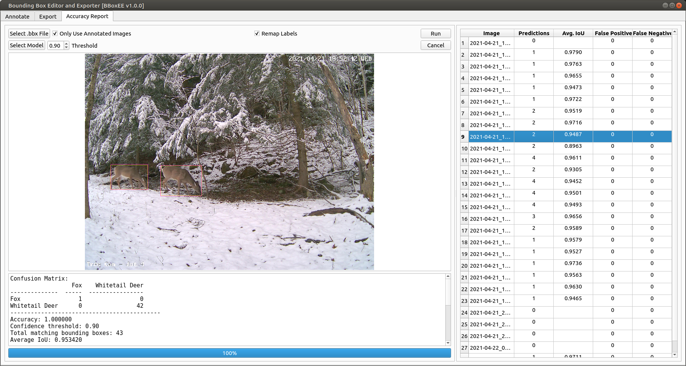

# BBoxEE Quick Start Guide
<div style='text-align: right;'> Release 1.0.0 </div>
<div style='text-align: right;margin-top:20px;font-size:2em'> Peter J. Ersts </div>
<div style='text-align: right;margin-top:20px'> June 2021</div>

[TOC]

---


This quick start guide is intended to introduce the basic functionality of BBoxEE. It is not intended to be a comprehensive user guide.


---

<div style="page-break-after: always;"></div>


BBoxEE is a open-source tool for annotating bounding boxes and exporting data to training object detectors. BBoxEE was specifically developed for the [Animal Detection Network (Andenet)](http://biodiversityinformatics.amnh.org/ml4conservation/animal-detection-network/) initiative, however, it is not limited to annotating camera trap data and can be used for any bounding box annotation task.

Source: https://github.com/persts/BBoxEE

## License

BBoxEE is free software: you can redistribute it and/or modify it under the terms of the GNU General Public License as published by the Free Software Foundation, either version 3 of the License, or (at your option) any later version.

BBoxEE is distributed in the hope that it will be useful, but WITHOUT ANY WARRANTY; without even the implied warranty of MERCHANTABILITY or FITNESS FOR A PARTICULAR PURPOSE. See the GNU General Public License for more details. You should have received a copy of the GNU General Public License along with with this software. If not, see http://www.gnu.org/licenses/.

The demo data included in BBoxEE repository were collected by Peter J. Ersts and have been released into the Public Domain.

<div style="page-break-after: always;"></div>
## Data Layout & Project Configuration
<div style='float:right;text-align:center;font-size:0.8em'><br/><strong>Figure 1.</strong> Directory structure.</div>
### Directory Structure
Many researchers use their computer's file system as a pseudo-database for initially storing image data from collection events (Figure 1). BBoxEE was designed to work on a single directory of images at a time. 

### Configuration File

BBoxEE uses a simple JSON format to store label and license information. You can have multiple configuration files for different projects or even within the same project. When you select a directory or existing annotation file, BBoxEE will traverse up your directory structure and use the first configuration file it finds. 

When you begin a new project, copy the default bboxee_config.json file to the top level of your project and edit with your favorite text editor.

#### Example Configuration File

```json
{
    "labels": [
        "Human",
        "Whitetail Deer"
    ],
    "license": {
        "default": {
            "attribution": "Jane Smith",
            "license": "Attribution 4.0 International (CC BY 4.0)",
            "license_url": "https://creativecommons.org/licenses/by/4.0/"
        },
        "licenses": [
            {
                "name": "Attribution 4.0 International (CC BY 4.0)",
                "url": "https://creativecommons.org/licenses/by/4.0/"
            }
        ]
    }
}
```
### Special Label
If you need to include hard negative images to help reduce false positives in your model, draw a single box on an image and assigned a label of *Negative*. During export, the image will be added to the training set without any bounding boxes.

*Note this special label/behavior is currently only available when exporting to the TensorFlow Record format.*

<div style="page-break-after: always;"></div>
## Annotating Images


<div style='text-align:center;font-size:0.8em'><strong>Figure 2.</strong> BBoxEE annotation interface.</div>

### Interface Buttons

* () Zoom in by pressing this button or using the mouse wheel
* () Zoom out by pressing this button or using the mouse wheel
* () Load the next image
* () Load the previous image
* () Jump the next image with an annotation, skipping all unannotated images in between
* () Jump the previous image with an annotation, skipping all unannotated images in between
* () Delete all bounding boxes on the current image
* () Toggle the visibility of bounding boxes
* () Show a quick summary of annotations
* () Filter image list by label
* () Reset label filter
* () Auto advance through images

The vertical slider left of the image display area changes the mid point of the color range for each channel in your image to brighten or darken the image.

### Loading Data

There are two ways to load data into BBoxEE:

1. Select a directory ()
2. Select an existing annotation file ()

Selecting an existing annotation file will allow you to pick up where you left off or edit/correct existing bounding boxes.

### Defining a Bounding Box

1. Left click and drag on the image to define a new bounding box.
2. Select the label from the pull down menu in the bounding box table or hover over the bounding box to make it active and press the first letter of label you want to assign to cycle through all labels that begin with that letter. 

If you need to draw a bounding box that starts or is completely contained within another bounding box, press and hold the CTRL key then left click and drag to define the new bounding box.

### Moving a Bounding Box
1. Hover over an existing bounding box to make the box active.
2. Left click and drag to move the bounding box.

### Adjusting a Bounding Box

1. Hover over an existing bounding box to make the box active.
2. Hover over the edge or corner that you want to adjust then left click and drag to adjust the bounding box.

### Deleting a Bounding Box

There are two ways to delete a bounding box.

1. Press the button in a row of the bounding box table.
2. Press the button in the tool bar to clear all bounding boxes for the current image.

### Selecting a Bounding Box ( Sticky Mode )
There are two ways to select a bounding box.
1. Hover over a bounding box to activate it then left mouse click.
2. Click a row number in the bounding box table.

While in sticky mode mouse events over other bounding boxes will be ignored. To exit sticky mode, left mouse click on the image anywhere outside of a bounding box.

### Saving

All annotation data are saved in a .bbx file that must be saved inside the same directory with the associated images. The annotation file is a simple JSON format. BBoxEE does not save full path names to images, thus allowing you to reorganize and move your image directories as needed without impacting your existing annotations.

Save often!

<div style="page-break-after: always;"></div>

## Exporting Your Bounding Boxes

You can export your bounding boxes for use in your favorite machine learning pipeline. BBoxEE currently supports three formats.

1. Tensorflow Record
2. YOLO v3
3. COCO Format

### Export

1. Click the Export tab.
2. Press the button.
3. Select the top level directory of your project. BBoxEE will find all of the annotation (.bbx) files and display them in the table.
4. Select the rows that you want to include in the export.
5. Rename labels if needed.
6. Select an export format from the pull down.
7. Press the export button.


<div style='text-align:center;font-size:0.8em'><strong>Figure 3.</strong> Exporting bounding boxes to train object detectors.</div>

### Renaming and Excluding Labels
To rename a label, simply double click in the New Label cell and type your new label.  If you want to skip bounding boxes with a certain label, type *Exclude* in the New Label cell.

You can also merge labels. For example, if you have bounding boxes labeled *Red Squirrel* and *Gray Squirrel* you can enter a new label of *Squirrel* for both to merge them into a single class.

During export a label_remap.json file will be created in your export directory. If you need to later re-export your data you can load an existing remap file, rather than typing in each new label, by clicking the  button and selecting an existing label_remap.json file.

<div style="page-break-after: always;"></div>
## Accuracy Assessment


<div style='text-align:center;font-size:0.8em'><strong>Figure 4. </strong>Accuracy assessment.</div>
1. Start by clicking the [Select .bbx File] button to load an existing set of bounding boxes that will be considered the gound truth or ideal expected results.
2. If you have not labeled every image in the directory, click the check box to only use annotated images.
3. Click the [Select Model] button to load the model you want to evaluate.
4. Select a confidence threshold.
5. If you renamed or merged several labels, click the Remap Labels check box to load the label_remap.json file associated with training data used to build the model being tested.
6. Click [Run] button to start the evaluation. 

The report will include a confusion matrix for the matching bounding bounding boxes and the average IoU (intersection over union).  A summary of false positive and false negative counts is also provided.

Clicking on a row the results table will display the image the bounding boxes. The ground truth bounding boxes are yellow, and the machine generated bounding boxes are magenta.

<div style="page-break-after: always;"></div>
## Keyboard Shortcuts

### Nudge
You can use the arrow keys to move the active bounding box.

### Expand & Shrink
SHIFT+Right-Arrow - Expand bounding box to the right.
SHIFT+Left-Arrow - Contract bounding box from the right.

SHIFT+Up-Arrow - Expand the top of the bounding box.
SHIFT+Down-Arrow - Contract bounding box from the top.

### Duplicate
CTRL+C - Duplicate the selected bounding box and place at the current cursor location.

### Delete Bounding Box
CTRL+D - Delete the selected bounding box.
CRTL+SHIFT+D - Delete all bounding boxes on current image.

### Hide & Show
CTRL+H - Toggle bounding box visibility.

### Next & Previous Row
Tab - Select next row.
SHIFT+Tab - Select previous row.

### Next & Previous Image
Space - Next image.
CTRL+Space - Previous image.

SHIFT+Space - Next annotated image.
CRTL+SHIFT+Space - Previous annotated image.

### Pan
SHIFT+Left-click+Drag - Pan image.
Right-click+Drag - Pan image.

<div style="page-break-after: always;"></div>
## Acknowledgements
I would like to thank the following people for their feedback, data, and support during the development of BBoxEE.
* Ned Horning, Center for Biodiversity and Conservation 
* Mark Weckel, Gotham Coyote Project
* Chris Nagy, Minus River Gorge
* Waylon Flinn [ Code Contributor ]
* Shannon Lambert