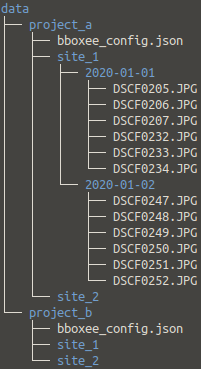
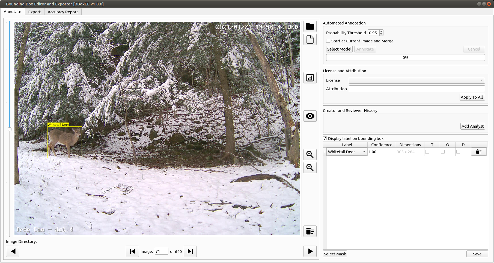
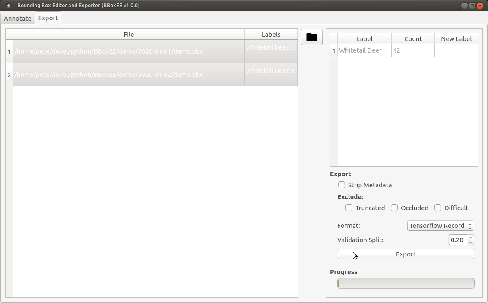

# BBoxEE Quick Start Guide
<div style='text-align: right;'> Release 1.0.0 </div>
<div style='text-align: right;margin-top:20px;font-size:2em'> Peter J. Ersts </div>
<div style='text-align: right;margin-top:20px'> January 2020</div>
[TOC]

___


This quick start guide is intended to introduce the basic functionality of BBoxEE. It is not intended to be a comprehensive user guide.


---

If you use BBoxEE on data that results in a publication, report, or online analysis, we ask that you include the following reference:

Ersts,P.J. [Internet] BBoxEE (version 1.0.0). American Museum of Natural History, Center for Biodiversity and Conservation. Available from [https://github.com/persts/BBoxEE](https://github.com/persts/BBoxEE). Accessed on [DOWNLOAD DATE].

<div style="page-break-after: always;"></div>


BBoxEE is a open-source tool for annotating bounding boxes and exporting data to training object detectors. BBoxEE was specifically developed for the [Animal Detection Network (Andenet)](http://biodiversityinformatics.amnh.org/ml4conservation/animal-detection-network/) initiative, however, it is not limited to annotating camera trap data and can be used for any bounding box annotation task.

Source: https://github.com/persts/BBoxEE

## License

BBoxEE is free software: you can redistribute it and/or modify it under the terms of the GNU General Public License as published by the Free Software Foundation, either version 3 of the License, or (at your option) any later version.

BBoxEE is distributed in the hope that it will be useful, but WITHOUT ANY WARRANTY; without even the implied warranty of MERCHANTABILITY or FITNESS FOR A PARTICULAR PURPOSE. See the GNU General Public License for more details. You should have received a copy of the GNU General Public License along with with this software. If not, see http://www.gnu.org/licenses/.

The demo data included in BBoxEE repository were collected by Peter J. Ersts and have been released into the Public Domain.

<div style="page-break-after: always;"></div>
## Data Layout & Project Configuration
<div style='float:right;text-align:center;font-size:0.8em'><br/><strong>Figure 1.</strong> Directory structure.</div>
### Directory Structure
Many researchers use their computer's file system as a pseudo-database for initially storing image data from collection events (Figure 1). BBoxEE was designed to work on a single directory of images at a time. 

### Configuration File

BBoxEE uses a simple JSON format to store label and license information. You can have multiple configuration files for different projects or even within the same project. When you select a directory or existing annotation file, BBoxEE will traverse up your directory structure and use the first configuration file it finds. 

When you begin a new project, copy the default bboxee_config.json file to the top level of your project and edit with your favorite text editor.

#### Example Configuration File

```json
{
    "labels": [
        "Human",
        "Whitetale Deer"
    ],
    "license": {
        "default": {
            "attribution": "Jane Smith",
            "license": "Attribution 4.0 International (CC BY 4.0)",
            "license_url": "https://creativecommons.org/licenses/by/4.0/"
        },
        "licenses": [
            {
                "name": "Attribution 4.0 International (CC BY 4.0)",
                "url": "https://creativecommons.org/licenses/by/4.0/"
            }
        ]
    }
}
```

<div style="page-break-after: always;"></div>
## Annotating Images

### Loading Data

There are two way to load data into BBoxEE:

1. Select a directory ()
2. Select an existing annotation file ()

Selecting an existing annotation file will allow you to pick up where you left off or edit/correct any existing bounding boxes.

### Interface Buttons

* () Zoom in by pressing this button or using the mouse wheel
* () Zoom out by pressing this button or using the mouse wheel
* () Load the next image
* () Load the previous image
* () Jump the next image with an annotation, skipping all unannotated images in between
* () Jump the previous image with an annotation, skipping all unannotated images in between
* () Delete all bounding boxes on the current image
* () Toggle edit mode
* () Clear all click indicators by pressing this button or pressing the mouse wheel (i.e., third mouse button)

You can pan around the image with the typical left mouse click + drag motion. When edit mode is activated, a left mouse click will drop a click indicator (see below). 

If you zoom in while edit mode is active, edit mode will be disabled as your next action will likely be to pan the image to center your object in the display area.

### Define a Bounding Box

BBoxEE implements a four click method for defining bounding boxes (Figure 2). After the fourth mouse click  the bounding box will be created and displayed along with an Annotation Assistant dialog where you can select the label for your bounding box.

1. Zoom in and center your target in the display area.
2. Press the button to enter edit mode.
3. Left mouse click on the lower most point of your target.
4. Left mouse click on the right most point of your target.
5. Left mouse click on the upper most point of your target.
6. Left mouse click on the left most point of your target.
7. Select your target's label from the Annotation Assistant dialog's select box and check any of the descriptive features that apply.
8. Press the submit button.



<div style='text-align:center;font-size:0.8em'><strong>Figure 2.</strong> BBoxEE implements a four click method for defining bounding boxes.</div>
### Adjusting a Bounding Box

1. Zoom in and center your target in the display area.
2. Press the button to enter edit mode.
3. If the bounding box is not already active (red) left mouse click inside the bounding box to make it active.
4. Left mouse click and hold inside the bounding box near the corner that need to be adjusted.
5. Drag the mouse to resize the box.
6. Release the mouse button to save the updated bounding box.

### Deleting a Bounding Box

There are two ways to delete a bounding box.

1. Double click a row in the bounding box table.
2. Press the button to clear all bounding boxes for the current image.

### Saving

All annotation data are saved in a .bbx file that must be saved inside the same directory with the associated images. The annotation file is a simple JSON format. BBoxEE does not save full path names to images, thus allowing you to reorganize and move your image directories as needed without impacting your existing annotations.

Save often!

<div style="page-break-after: always;"></div>
### Annotation Notes

* While you could use a mouse pad with BBoxEE, it is **highly** recommended that you use a good quality mouse with a wheel.
* The annotation interface has been optimized for use with a stylus pen and touch screen computer. We used a Microsoft Surface Pro 6 during the optimization of BBoxEE and found it to be the most comfortable and efficient way to define or update bounding boxes.
* If you have a situation where you will have one or more bound boxes completely contained within a larger bounding box, you have to create the smaller bounding boxes first.
* There are a number of keyboard short cuts that are not discussed in this quick start guide.

## Exporting Your Bounding Boxes

You can export your bounding boxes for use in your favorite machine learning pipeline. BBoxEE currently supports three formats.

1. Tensorflow Record
2. YOLO v3
3. COCO Format

### Export

1. Press the button.
2. Select the top level directory of your project. BBoxEE will find all of the annotation (.bbx) files and display them in the table.
3. Select the rows that you want to include in the export.
4. Select an export format from the pull down.
5. Press the export button.



<div style='text-align:center;font-size:0.8em'><strong>Figure 3.</strong> Exporting bounding boxes to train object detectors.</div>
<div style="page-break-after: always;"></div>
## Acknowledgements
I would like to thank the following people for their feedback, data, and support during the development of BBoxEE.
* Ned Horning, Center for Biodiversity and Conservation 
* Mark Weckel, Gotham Coyote Project
* Chris Nagy, Minus river Gorge