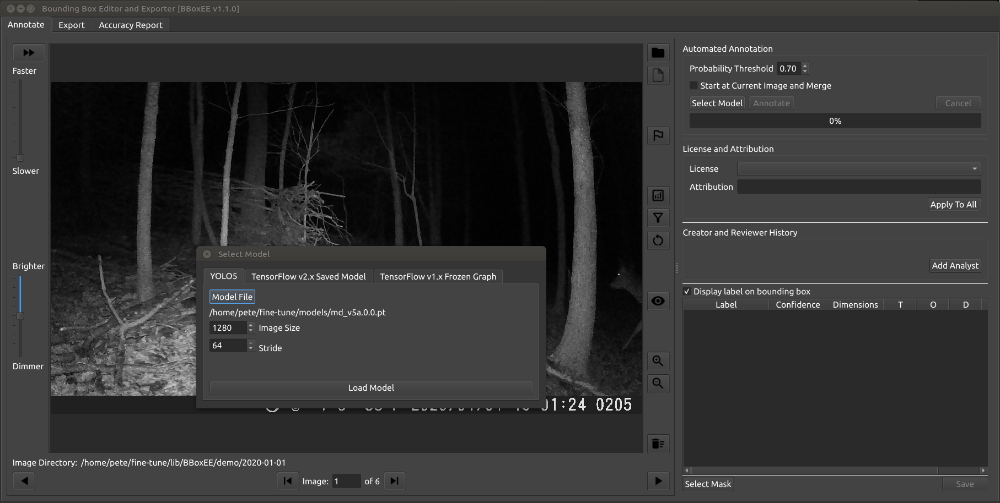
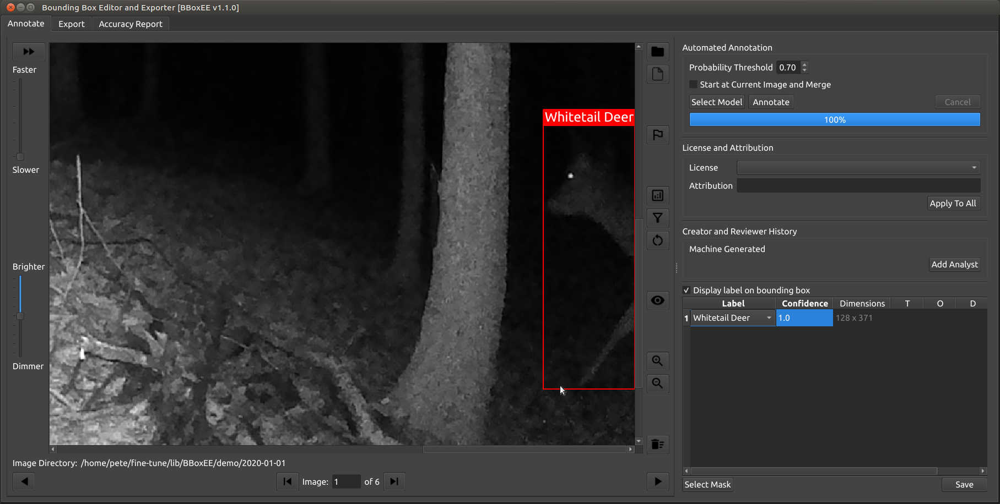
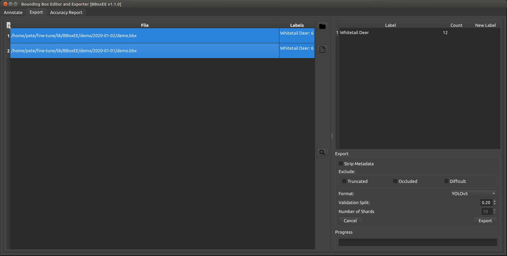
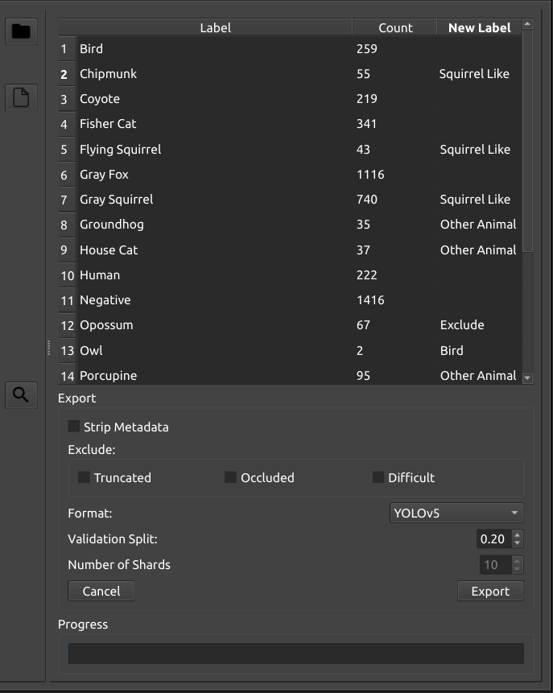

# Fine-tuning Existing Model With Custom Dataset

The objective of this use case / tutorial is to demonstrate a BBoxEE workflow to leverage the power of an existing model to help jump start your annotation of a custom dataset and then fine-tune that model to your project's needs. Fine-tuning allows you to take advantage of an existing model and tailor it to your needs in less time and with less data compared to building a model from scratch. Fine-tuning takes advantage of a technique called transfer learning.

This tutorial will focus on camera trap data and the popular MegaDetector model. 

## Prerequisites
* Python3
* Git
This tutorial was created with Python v3.8.10 (Ubuntu).

## Setting up your environment
For this tutorial I will be working in my home directory.

First open a new terminal.
```bash
mkdir fine-tune
cd fine-tune
python3 -m venv venv
source venv/bin/activate
python -m pip install --upgrade pip

mkdir lib
git clone https://github.com/persts/BBoxEE lib/BBoxEE
python -m pip install -r lib/BBoxEE/requirements.txt

git clone https://github.com/ultralytics/yolov5 lib/yolov5
python -m pip install -r lib/yolov5/requirements.txt

deactivate

mkdir models
wget https://github.com/agentmorris/MegaDetector/releases/download/v5.0/md_v5a.0.0.pt -O models/md_v5a.0.0.pt

mkdir training-data
mkdir modeling-building
```
Your environment is all set up and ready for annotation and model training!

## Starting a new annotation or editing session
Each time you open a new terminal you will need to initialize your session
```bash
cd ~/fine-tune
source venv/bin/activate
export PYTHONPATH=~/fine-tune/lib/yolov5
```

## Begin annotating your data
For this tutorial we will just be using the demo data that comes with BBoxEE.

First launch BBoxEE.
```bash
python lib/BBoxEE/main.py
```


Click the Select Folder button and select the lib/BBoxEE/demo/2020-01-01 directory.

In the Automated Annotation panel, change the Probability Threshold to 0.7 and click the Select Model button to open the model selection dialog. On the YOLO tab, click the Select Model button and select the models/md_v5a.0.0.pt file and click the Load Model button.



In the Automated Annotation panel, click the Annotate button to start the model running. It will take a few seconds for the model to load and initialize before the annotation process starts running. If you do not have a GPU, annotation may take a couple of seconds per images. 

Once the annotation process has completed, your next task is to review the bounding boxes and assign your project specific labels.

## Review bounding boxes
The demo data comes with a default bboxee_config.json file. This file holds your project specific labels and licensing information. When it comes time to annotation your own data, you will need to copy the bboxee_config.json file to the top level directory where you have stored your data and edit this file to include your project's labels. 

You can use the interface buttons to move between images and zoom in and out or use the following shortcuts:
* Zoom In & Zoom Out: Mouse wheel
* Pan: Click and drag with the right mouse button
* Next Image: SpaceBar
* Previous Image: Ctrl+SpaceBar

Additional usage information can be found the in the [quick start guide](https://github.com/persts/BBoxEE/blob/master/doc/Quick%20Start%20Guide.pdf).



Magenta bounding boxes are bounding boxes generate by a model. Yellow bounding boxes are bounding boxes create or modified by a human analyst. 

You can use the pull-down menu in the label display table to change the label for a bounding box. Alternatively, you can just hover over the bounding box and press the letter corresponding to the first letter of label you want to assign. If you have multiple labels that start with the same letter, keep pressing that letter to cycle through all of the possible labels.

To adjust a bounding box, hover over the bounding box edge or corner then left click and drag to resize the bounding box if needed. If you have a number of overlapping boxes, you can left click a bounding box or click on the corresponding row number in the label display table to make the bounding box "sticky." This will prevent your mouse movements from activating another bounding box. To remove the sticky flag, left click anywhere on the image outside of a bounding box.

Your bounding boxes should be a tight as possible around the target. If you have overlapping bounding boxes the labels can sometimes get in the way. To prevent the labels from being displayed on the bounding boxes uncheck [Display label on bounding box].


Systematically review all of your images and adjust bounding boxes as needed. When done, save your changes.

If you get a false positive detection on an images that has actual targets, just delete the erroneous bounding box. However, if you are getting a number of high confidence false positives on images that do not contain any true targets, you can label the false positive as a "Negative." This special label will add the image to the training set with no bounding boxes associated with the image. This is called a hard negative example. You only need one Negative label per image and, again, that image should NOT include any true targets. 

## Exporting training data
When you are ready to build your training dataset, click on the Export tab. 

Click the folder icon and select the top level directory under which you have stored all of your annotated data. In this example that is lib/BBoxEE/demo. 

BBoxEE when then search all sub directories and find all of your .bbx files. If you have a large dataset, this can take some time to complete. 



To select all of the rows, click the column header above the row numbers. If you have multiple .bbx files in the same image folder, you will need to manually select the rows you want include by holding down the Ctrl key and left clicking on the row number. The best practice is to only have one final .bbx file for each directory of images.

Select YOLOv5 from the format pull down and set your training / test split to a desired value. Click the Export button and select the training-data folder you created during setup. 

### Additional export functionality


At the time of export you can make some additional changes to the labels. This only affects the exported labels and does not make any changes to the original labels stored in your .bbx files. 

You can exclude labels by typing "Exclude" in the New Label column. Likewise, you can group labels by giving them the same new label. This is helpful when you have too few annotations for a particular class but may have enough in the future and want your model to start to be able learn features related to this category of targets. 

At the time of export it is not uncommon to see a label that is clearly a mistake. You can click on the Search button to find which .bbx file contains the labels you are searching for. When the results dialog pops up, you can double click on a row and it will open that .bbx file in the Annotate tab. Once you make changes and save your .bbx file, the changes will be reflected on the Export tab when you return. 

## Batch annotation
If you have a large number images directories to process or a large number images per directory, you may want to start the batch annotation process and just walk away for a couple of days.

USAGE: python annotate_yolov5.py TOP_DATA_FOLDER MODEL SHAPE STRIDE CONFIDENCE

```bash
cd ~/fine-tune
python lib/BBoxEE/cloud/annotate_yolov5.py lib/BBoxEE/demo models/md_v5a.0.0.pt 1280 64 0.7
```
Reviewing and correcting bounding boxes in BBoxEE take very little resources and can be run on a very minimal computer. If your don't have a GPU but have access to a cloud based GPU instance, you could run the batch annotation process on the cloud then download the data and edit on a basic laptop.

If you have an existing dataset with image level labels, you may be interested in [this use case](existing-dataset.md).

## Fine-tune model
Start the training process.
```bash
cd model-building
cp ~/fine-tune/lib/yolov5/data/hyps/hyp.no-augmentation.yaml .
python ../lib/yolov5/train.py --data ../training-data/dataset.yaml --weights ../models/md_v5a.0.0.pt --img 1280 --hyp hyp.no-augmentation.yaml --freeze 13 --epochs 5 --batch 10 --project .
```
Congrats! You have a full training pipeline set up. The model results will be saved to a directory called exp. Each time you restart the training process the exp directory will be incremented with a number, e.g., a second training run will be saved in exp2.

Now for the bad news...Obviously the model we just trained will be terrible as we only had 12 images and one class in the dataset. A big part of training, and fine-tuning, models has to do with hyperparameter optimization. Hyperparameter optimization has a lot to do with your specific dataset. The default parameters used here are a good place to start, but are far from optimal and hyperparameter optimization is beyond the scope of this tutorial. 

Here are just some thoughts and things to consider.
* Training on the CPU will not be realistic, you really need to use a GPU
* Batch size will depend on your resources. Batch size of 10 with --img 1280 works on a GPU with 8GB of RAM.
* The smaller your batch size the smaller your learning-rate should be
* Number of epochs needed will depend on the size of your dataset and your learning rate. 20 epochs with 20k images and 9 classes produced a very usable model in less than 24 hours on a NVIDIA 1080Ti GPU
* If you are going to be training on a GPU cloud instance, you can follow the same setup instructions but simply skip cloning BBoxEE.

## Model evaluation and the active learning cycle
YOLO will output a number of statistics during the training process. BBoxEE also has a Accuracy Report tab where you can run your new model on a directory of images you have previously annotated and compare the model's results to your annotations.

Once you have a decent model, use that model in BBoxEe to annotation any new data. Training statistics and accuracy reports are helpful, but using your new model regularly in your workflow will allow you get a much better sense for the types of images it is failing on. After you annotation more data with your new model, you can continue to fine-tune your custom model by using it's weights rather than the MegaDetectors in the Fine-tune model section of the tutorial. Basically these steps are a continuous cycle until you have a production quality model.  